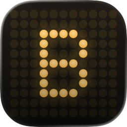
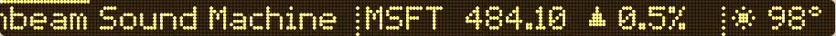
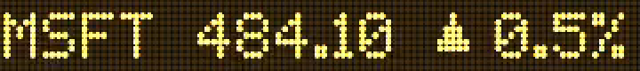
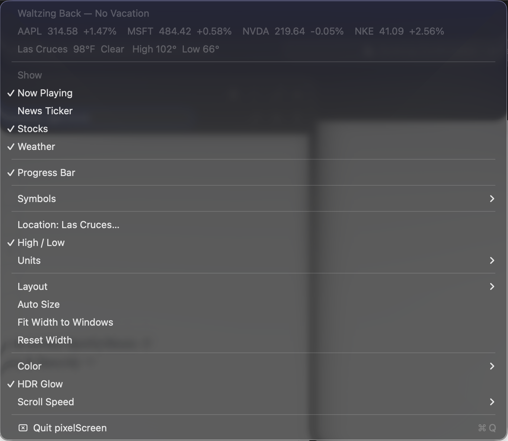

<p align="center">
  
</p>

<h1 align="center">pixelScreen</h1>

<p align="center">A dot-matrix LED sign that lives in your macOS menu bar.</p>

<p align="center">
  
</p>

<p align="center"><em>Shown at actual size — that really is how much menu bar it takes up.</em></p>

It renders a real dot grid in the status bar and scrolls whatever you turn on
through it: the track you're playing, news headlines, stock quotes, and the
weather. The panel scrolls in whole dot-columns rather than smooth subpixel
steps, which is what makes it read as a physical board instead of recoloured
text.

The app is a status item only — no dock icon, no window (`LSUIElement`).
Everything is configured from the menu you get by clicking the panel.

## What you're looking at

<p align="center">
  
</p>

Widgets aren't exclusive — several run at once and lay out side by side as
*zones*, each owning a slice of the columns and deciding for itself whether it
moves. Above, left to right: the now-playing title scrolling (with the thin
progress bar riding along the top row), then `MSFT 484.10 ▲0.5%`, then `98°`.
Only one zone can hold the flexible width, so the widgets that need a whole
line of text — the track title, the news crawl — take it in priority order
rather than sharing it.

Up close, the dots are the whole point — there is no font rasterizer here, and
nothing is antialiased into place:

<p align="center">
  
</p>

## The menu

Clicking the panel opens everything there is to configure — there is no
preferences window:

<p align="center">
  
</p>

The three greyed rows at the top aren't controls, they're a read-out: the full
track title, every quote you're tracking, and the current conditions, all in
plain text. The panel only ever shows you a slice of that at a time, so this is
where you look when something has already scrolled past.

Below that:

- **Show** — which widgets get a zone. **Symbols** edits the stock list,
  **Location** and **Units** the weather.
- **Layout** — *Separate Windows* gives each widget its own zone scrolling
  independently, the way a multi-panel sign works; *One Shared Band* makes them
  take turns across the full width instead. The width controls (**Auto Size**,
  **Fit Width to Windows**) only apply to the first one.
- **Color** — five schemes, each drawn as a swatch in the menu so you can tell
  them apart: Amber (shown throughout this README), Green, Red, Ice and Mono.
- **HDR Glow** — drives the lit dots past SDR white on a display with headroom.
  Needs macOS 26, and greys itself out with the reason in the title when your
  display can't do it.

## Requirements

- macOS 13 or later
- Xcode 16 or later (the project uses synchronized file groups, `objectVersion 77`)

No package manager, no dependencies, nothing to install. Clone and open.

## Building

```
open pixelScreen.xcodeproj
```

Then pick your own signing team the first time:

**Signing & Capabilities → Team → (your account)**

The team is deliberately left blank in the project so it doesn't carry one
developer's ID into everyone else's checkout. You may also want to change
`PRODUCT_BUNDLE_IDENTIFIER` from `com.danielmoreno.projects.pixelScreen` to
something under your own domain.

A free personal Apple ID team is enough — the app is sandboxed but uses no
paid capabilities. It also builds and runs unsigned with no team selected at
all, which is the fastest way to just try it.

From the command line:

```
xcodebuild -scheme pixelScreen -configuration Debug build
```

## Services it talks to

Every source is keyless, so there is no configuration file and no secret to
obtain:

| Widget       | Source                                              |
|--------------|-----------------------------------------------------|
| Weather      | Open-Meteo (forecast + geocoding)                    |
| Stocks       | Yahoo Finance chart endpoint (undocumented; see `Stocks.swift`) |
| News         | Any RSS/Atom feed — BBC, NPR, Ars Technica, HN by default |
| Now Playing  | Spotify and Music, over AppleScript                  |

Now Playing needs one thing that isn't automatic: on first run macOS asks for
permission to control Spotify/Music. If you decline it, the widget stays empty
until you re-allow it under System Settings → Privacy & Security → Automation.

## Layout of the code

| File | What's in it |
|------|--------------|
| `pixelScreenApp.swift` | App delegate, status item, and the whole menu |
| `TickerView.swift` | The dot panel view — geometry, clock, drawing |
| `Board.swift` | Zone layout: how widgets share the panel's columns |
| `BoardTheme.swift` | Colour schemes |
| `PixelFont.swift` / `PixelFontData.swift` | The hand-drawn 5x7 font and its typesetter |
| `Preferences.swift` | Widget list and persisted settings |
| `NowPlaying.swift`, `Feed.swift`, `Stocks.swift`, `Weather.swift` | Data sources |

Each file opens with a comment explaining why it works the way it does — start
with `Board.swift` if you want to add a widget, and `PixelFontData.swift` if
you want to change how a character looks (the source art is literal ASCII;
what you see is what lights up).

## Adding a scriptable music player

Two places: the bundle id has to be listed in `pixelScreen.entitlements` under
`com.apple.security.temporary-exception.apple-events` (the sandbox requires
each app be named individually), and the lookup itself goes in
`NowPlaying.swift`.
